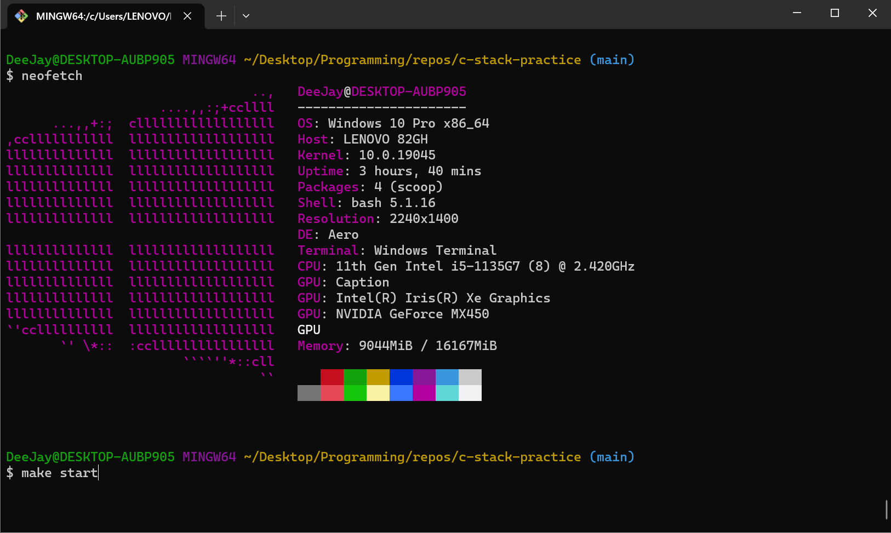

# c-stack-practice

Implementations of a stack data structure in C & Java.



# Usage

```bash
# THIS IS FOR THE FLEXIBLE IMPLEMENTATION, SEE THE SIMPLER IMPLEMENTATION BELOW
git clone git@github.com:Luzefiru/c-stack-practice.git
cd c-stack-practice

make                # builds & runs the array C implementation
make TYPE=list      # builds the list implementation
make TYPE=cursor    # builds the cursor implementation

make start-java     # builds & runs the Java implementation
make clean          # deletes .o & .class build artifacts
```

```bash
# THIS IS THE SIMPLER IMPLEMENTATION WHERE EVERYTHING IS INCLUDED IN .H FILES
git clone git@github.com:Luzefiru/c-stack-practice.git
cd c-stack-practice
git checkout header

make
make start-java
make clean
```

You'll need to run `make start` in a Bash instance or use [GNUWin](https://gnuwin32.sourceforge.net/install.html) to add the `make` command to cmd.

### Changing the Implementation

The `Makefile` `TYPE` variable is optionally assigned to `array` if we do not explicitly pass it as a command-line argument.

```Makefile
# "assign TYPE to the environment variable TYPE, otherwise default to array
TYPE ?= array # can also be list or cursor

# the compiled stack object code
stack.o:
	gcc -c ./src/stack/$(TYPE)/stack.c
```

We can override this default behavior by [setting an environment variable](https://unix.stackexchange.com/questions/56444/how-do-i-set-an-environment-variable-on-the-command-line-and-have-it-appear-in-c) or passing the assignment as an argument to `make` explicitly.

```bash
make             # defaults to array implementation
make TYPE=list   # builds the list implementation
make TYPE=cursor # builds the cursor implementation

TYPE=list make   # same behavior
```

# File Structure

> File directory structure follows the [pitchfork](https://github.com/vector-of-bool/pitchfork) convention used in big C++ and C projects.

```
Makefile                  # build scripts
src/
├── main.c                # driver program
└── stack/
    ├── array/
    │   └── stack.c       # array implementation
    ├── cursor/
    │   └── stack.c       # cursor-based list implementation
    ├── list/
    │   └── stack.c       # linked list implementation
    │
    └── java/             # Java implementation
        ├── Main.class    # Java driver program
        ├── Stack.class   # Stack class & method definitions
        └── IStack.class  # IStack interface imitating a header file
include/
└── stack.h               # included header file with function prototypes & documentation
```

# Credits

- [C ASCII Color Escape Sequences](https://gist.github.com/RabaDabaDoba/145049536f815903c79944599c6f952a)
- [C & C++ Pitchfork File Directory Structure Convention](https://github.com/vector-of-bool/pitchfork)
